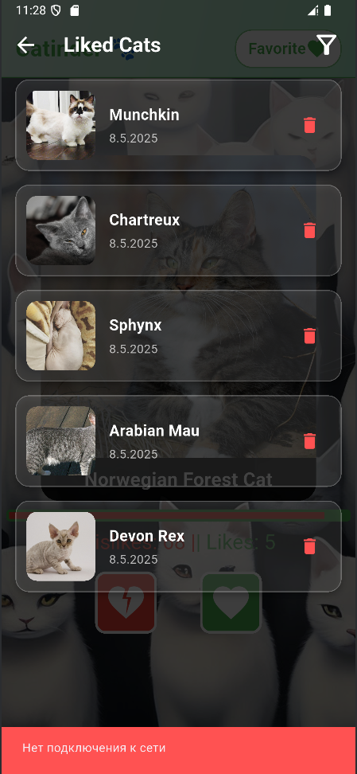

# 🐱 Catinder

Добро пожаловать в **Catinder** — мобильное приложение, в котором пользователи могут оценивать милых кошек, узнавать о различных породах и сохранять избранных. Поддерживается оффлайн-режим и фильтрация любимых питомцев.

## 🚀 Основные возможности

### 🐾 Получение случайной кошки
Интеграция с **TheCatAPI**: загрузка случайной породы с описанием и изображением.

Картинка, название породы и краткое описание отображаются на карточке.

### 💬 Интерактивное взаимодействие
- Свайп вправо — лайк, влево — дизлайк.
- Также доступны кнопки для оценки.

### 📄 Детали породы
По нажатию на карточку открывается экран с более подробной информацией.

### 📊 Статистика
В реальном времени отображается прогресс-бар с количеством лайков и дизлайков.

### ❤️ Экран «Понравившиеся кошки»
- Список всех лайкнутых котиков с подробным описанием по клику.
- Удаление из списка обновляет счётчик лайков.  
- Фильтрация по породе с помощью поиска или выпадающего списка.  

### 🌐 Обработка сетевых состояний
- При потере сети:
  - отображается **Snackbar** с предупреждением;
  - интерфейс продолжает работать с ранее загруженными данными;
  - лайки/дизлайки и свайпы блокируются;
  - кэшированные изображения всё ещё доступны.
- При восстановлении подключения показывается уведомление.

## ✅ Тесты
- Unit-тесты для проверки логики лайков/дизлайков.
- Используется **mocktail** для API и хранилищ.

## Уникальность
- При отсутствии интернета кнопки недоступны, свайпы заблокированы.

## Скриншоты

## Ссылка на скачивание APK
1.0: https://drive.google.com/file/d/1ACgm5ddTY_GltTF8lelyeIQURmFbkwL2/view?usp=sharing  
2.0: https://drive.google.com/file/d/10HXHYBiBqds_3gZKtppeC7Qj0CZR6rk0/view?usp=sharing  
3.0: https://drive.google.com/file/d/1iA2VBVbps8OiDKQQe-H1Z8qN4hkG1MY8/view?usp=sharing