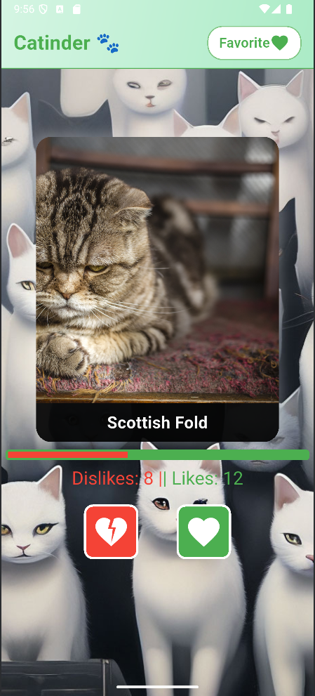
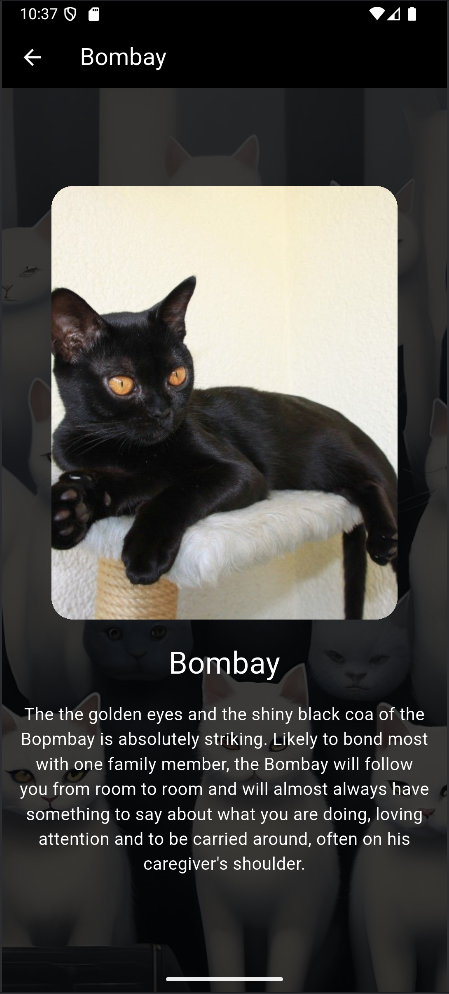

# Catinder

Добро пожаловать в **Catinder** — приложение, в котором пользователи могут просматривать изображения милых кошек и оценивать их, ставя "лайк" или "дизлайк". Приложение получает случайные породы кошек с помощью API и предоставляет информацию о них, что позволяет интересно и весело изучать различные породы кошек.

## Функции

- **Отображение случайной кошки**: Приложение получает случайную породу кошек с помощью TheCatAPI и отображает информацию о породе и изображение.
- **Взаимодействие с жестами свайпа**: Пользователи могут проводить пальцем влево (дизлайк) или вправо (лайк), чтобы взаимодействовать с изображениями кошек.
- **Кнопки лайк/дизлайк**: Пользователи могут также нажимать на кнопки лайка и дизлайка для голосования за любимых кошек.
- **Детали кошки**: При нажатии на изображение кошки можно увидеть подробную информацию о породе, включая изображение и описание.
- **Статистика голосования в реальном времени**: Отображается статистика количества лайков и дизлайков с прогресс-баром, показывающим соотношение лайков и дизлайков.

## Скриншоты

## Ссылка на скачивание APK