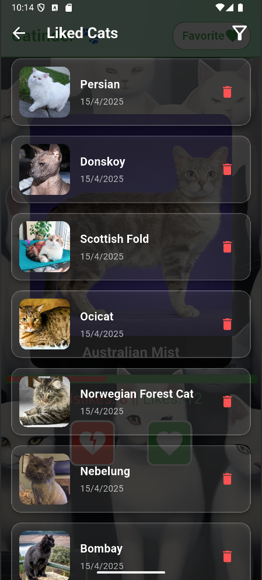
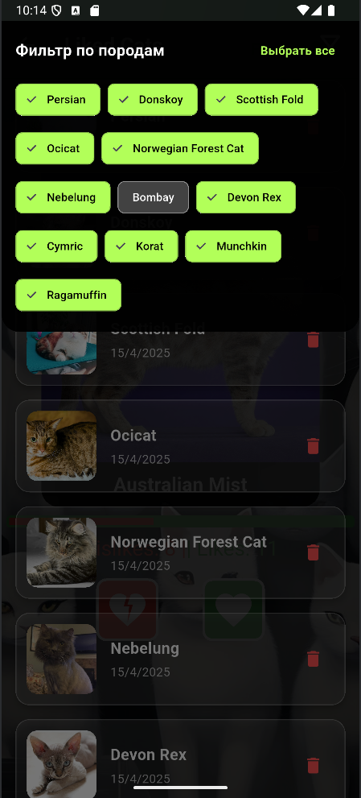

# Catinder

Добро пожаловать в **Catinder** — приложение, в котором пользователи могут просматривать изображения милых кошек, узнавать информацию о различных породах и оценивать их с помощью лайков и дизлайков. Теперь в приложении доступен экран избранных кошек с фильтрацией и возможностью управления списком.

---

## 🚀 Функциональные возможности

- **Случайная кошка с TheCatAPI**  
  Приложение запрашивает случайную породу кошки через TheCatAPI и отображает информацию о ней (изображение, название, описание).

- **Интерактивное взаимодействие**  
  Пользователи могут свайпать изображение кошки:
    - Вправо — лайк
    - Влево — дизлайк  
      Также доступны кнопки для лайка и дизлайка.

- **Экран деталей**  
  При нажатии на изображение открывается экран с подробной информацией о породе.

- **Статистика лайков/дизлайков**  
  В реальном времени отображается прогресс-бар с количеством лайков и дизлайков.

- **Экран лайкнутых котиков** 🐾
    - Отображает список всех лайкнутых кошек с информацией: изображение, порода, дата лайка.
    - **Удаление**: пользователь может удалить любую карточку, счётчик лайков автоматически обновляется.
    - **Фильтрация**: можно фильтровать список по породе с помощью выпадающего списка или строки поиска. Список обновляется мгновенно.
    - **Сброс данных**: список лайков хранится только в рантайме и очищается при перезапуске приложения.

- **Обработка состояния**
    - Прогресс-бар (`CircularProgressIndicator`) отображается при длительной загрузке.
    - Ошибки сети показываются через `AlertDialog`.

## Скриншоты

## Ссылка на скачивание APK
1.0: https://drive.google.com/file/d/1ACgm5ddTY_GltTF8lelyeIQURmFbkwL2/view?usp=sharing
2.0: https://drive.google.com/file/d/10HXHYBiBqds_3gZKtppeC7Qj0CZR6rk0/view?usp=sharing